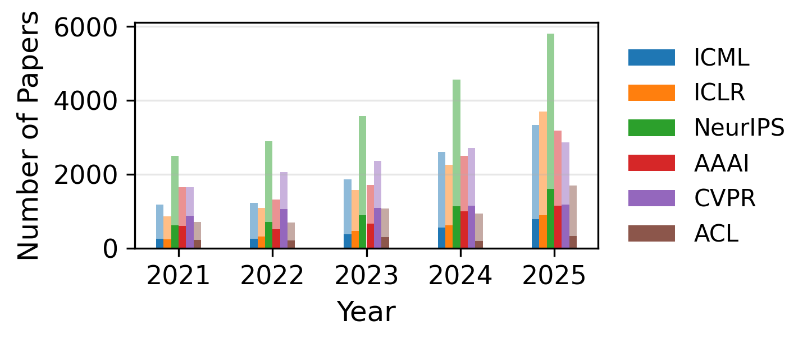

<div align="center">

# SOTA Mention Reproduction

**Reproduce Figure 1 and Appendix A** of
*Position: State-of-the-Art Claims Require State-of-the-Art Evidence*

Counts accepted papers whose abstracts mention state-of-the-art performance —
using [Paper Copilot](https://github.com/papercopilot/paperlists) metadata — and writes the paper's figure and tables.


</div>

---

> **Part of the [SOTA](../) reproducibility package** for *Position: State-of-the-Art Claims Require State-of-the-Art Evidence* ([arXiv:2605.17273](https://arxiv.org/abs/2605.17273)).

**Companion packages**

| Package | Reproduces |
|---|---|
| [`benchmark-fragility`](https://github.com/yongkyung-oh/benchmark-fragility) | reusable fragility metrics — Cohen's *d* · win rate · breakdown-point |
| [`sota-evidence`](../sota-evidence/) | Table 1 — MMLU fragility |
| **`sota-counter`** _(this package)_ | Figure 1 + Appendix A — SOTA mentions |

---

## 🚀 Quickstart

> [!NOTE]
> Requires **Python 3.10**. Use the included `environment.yml` for a ready-made
> conda environment.

```bash
conda env create -f environment.yml
conda activate sota-counter
python -m pip install -e .
mkdir -p data
git clone https://github.com/papercopilot/paperlists data/paperlists
python -m sota_counter reproduce
```

Point at a different Paper Copilot checkout if you already have one:

```bash
python -m sota_counter reproduce --paperlists-dir path/to/paperlists
```

<details>
<summary>📦 What it generates</summary>

```text
results/
├── figure1/
│   ├── trend.png            # Figure 1
│   ├── trend.pdf
│   └── figure1_input.csv
├── tables/
│   ├── accepted_counts.csv
│   ├── sota_counts.csv
│   ├── sota_ratios.csv
│   └── appendix_a_tables.tex   # Appendix A
└── check.json               # data commit · reference match · files written
```

`results/check.json` records the data commit, whether the output matches the
reference tables, and whether the expected files were written.

</details>

---

## 📊 Figure 1

<div align="center">



</div>

> *Published papers mentioning “state-of-the-art” in abstracts across major AI
> conferences (2021–2025). **Darker** bars indicate SOTA mentions; **lighter**
> bars indicate other papers.*

---

## 🔖 Data version

> [!TIP]
> Current Paper Copilot data works out of the box. To reproduce the **exact**
> paper tables, pin the reference commit below.

The paper tables were generated from Paper Copilot commit:

```text
29c55620f95f7965b7d2772fab08f35e08dacc8f
```

```bash
git -C data/paperlists checkout 29c55620f95f7965b7d2772fab08f35e08dacc8f
```

---

## 📈 Venue ratios (%)

SOTA-mention ratios for the paper period, 2021–2025. **Bold** venues are the six
shown in Figure 1; the rest are related AI/ML venues for comparison.

| Conference | 2021 | 2022 | 2023 | 2024 | 2025 |
|---|---:|---:|---:|---:|---:|
| **AAAI** | 36.82 | 39.04 | 38.72 | 39.98 | 36.39 |
| **ACL** | 32.68 | 30.14 | 27.81 | 20.53 | 19.72 |
| AISTATS | 12.75 | 11.99 | 12.50 | 12.80 | 15.09 |
| **CVPR** | 53.28 | 51.79 | 46.21 | 42.23 | 41.24 |
| CoRL | 22.22 | 24.37 | 20.10 | 20.83 | 25.10 |
| **ICLR** | 28.60 | 29.04 | 30.22 | 27.83 | 24.38 |
| **ICML** | 22.32 | 21.25 | 20.70 | 21.69 | 23.43 |
| **NeurIPS** | 25.00 | 24.68 | 24.97 | 25.05 | 27.72 |
| RSS | 22.83 | 20.27 | 22.32 | 23.88 | 16.56 |
| WACV | 52.71 | 52.96 | 51.17 | 46.10 | 45.53 |

<details>
<summary>📝 Notes on aggregates and a 2026 comparison</summary>

- Figure 1 is based on the six major venues; the additional rows give a simple
  comparison with four related venues.
- **Aggregate SOTA-mention ratio** — six Figure 1 venues: **33.38%** (2021) →
  **28.99%** (2025). All ten venues in the table: **32.95%** (2021) →
  **29.17%** (2025). The pattern is similar to the paper figure.
- **ICLR beyond the paper period** — the 2021–2025 annual average is **28.02%**.
  ICLR 2026 has **1,557** SOTA-mention papers out of **5,358** accepted
  (**29.06%**).

</details>

---

## 📄 Citation

```bibtex
@misc{oh_sota_2026,
  title        = {Position: {State}-of-the-{Art} {Claims} {Require} {State}-of-the-{Art} {Evidence}},
  author       = {Oh, YongKyung},
  year         = 2026,
  publisher    = {arXiv},
  doi          = {10.48550/arXiv.2605.17273}
}
```
